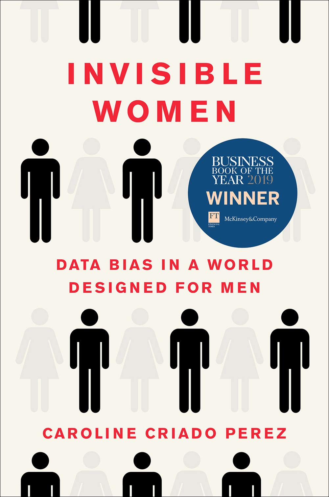

## Learn more about the data gap between men and women

Data Feminism by Catherine D'Ignazio and Lauren F. Klein

Invisible Women: Data Bias in a World Designed for Men by Caroline Criado Perez

## Learn more about women in the built environment 

Discrimination by Design: A Feminist Critque of the Man-Made Environment by Leslie Kanes Weisman

